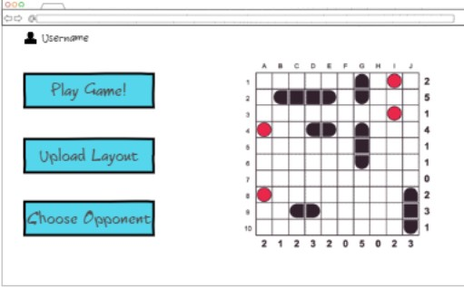

# cs260-README.md
## Startup Specification
### Elevator Pitch
I am planning on making a simplified version of Battleship with people online. After creating an account or logging into a pre-existing account, the user has the option to play against a randomly generated or pre-set battleship layout or create their own layout that can be challenged by others. While the default layouts will always be decided by the computer, you can also choose to challenge the layout of another real user.

### Key Features
**Play Battleship:** Users can play a simplified version of Battleship against a computer

**Save Layouts:** Users will be able to create a ship layout that will be saved and can be challenged by others

**Challenge Others:** Instead of playing against a random setup, you can challenge a layout created by another user

### Technologies
**Authentication:** Upon opening the website, users will be greeted by a login screen where they will be able to create an account or log in. Account information will be saved so they can continue to log in using the same account

**Database data:** Each player can save a board layout to a database that can then be played against by all other users. They can also update their board at any time.

**WebSocket data:** The server will render notifications for when a user creates or updates their board layout

### Images

## HTML deliverable
For this deliverable, I built out the structure of my application using HTML.

- **HTML pages** - Four HTML pages that represent the ability to learn about the game, log in, play the game, and save a layout.
- **Links** - Every page contains links to every other page
- **Text** - =Test instructions for how to utilize the site were added
- **Images** -  Updated the favicon image to something more fitting
- **Login** - Changed login to require both username and password
- **Database** - The layouts are represented by those stored in the database
- **WebSocket** - The layout will be updated in realtime to any additions or updates

 
## CSS deliverable

For this deliverable, I properly styled the application into its final appearance.

- **Header, footer, and main content body**
- **Navigation elements** - I formatted them to look more appealing and made them grow when hovered over
- **Responsive to window resizing** - My app looks great on all window sizes and devices
- **Application elements** - Used good contrast and whitespace
- **Game Layout Setup** Made the buttons look less out of place and added a highlight effect to show which is being selected
- **Application text content** - Consistent fonts and formatting changes to be more readable
- **Application images** - Gave the image an outlined border to make it stand out

## JavaScript deliverable

For this deliverable, I added functionality to my application

- **Login** Allowed for users to log in and for the information to be locally stored
- **Databases** Allowed for user layouts to be read and played against (Not fully implemented without databases) 
- **WebSocket** Created the basis for HTML to be updated when necessary (Not fully implemented without web socket)
- **Game Logic** Allowed for the user to play against a randomly generated layout.

## Service deliverable

For this deliverable, I added backend endpoints that receives layouts

- **Node.js/Express HTTP service** - done!
- **Static middleware for frontend** - done!
- **Calls to third party endpoints** - Calls to random quote in about section
- **Backend service endpoints** - Endpoints for the layouts.
- **Frontend calls service endpoints** - Implemented with the fetch function
- **Extra Note** The displayed layout info shows the grid values of the 10 buttons selected though a later implementation will change this to a link to play against those grid numbers instead.

## DB deliverable

For this deliverable I stored the layouts in the database.

- **MongoDB Atlas database created** - done!
- **Endpoints for data** - My stubbed out endpoints now process the data and send it to Mongo.
- **Stores data in MongoDB** - done!
